# Tạ Tuấn Khải

Computer Science student at HCMUT, based in Ho Chi Minh City. I am building toward **SOC L1 / Security Analyst** roles, with a longer-term interest in security analytics and AI assistance for analysts.

My recent projects combine Python backend development and computer vision.

[Portfolio](https://tuankhai1210.github.io/portfolio/) · [LinkedIn](https://www.linkedin.com/in/khai-ta-tuan-11a945414/) · [Email](mailto:tuankhaina1210@gmail.com)

<!-- AWAKEN:START -->
<!-- Generated by git-profile-awaken. Edit awaken.json instead of this block. -->

<picture><source media="(prefers-color-scheme: dark)" srcset="awaken/banner-dark.svg"><source media="(prefers-color-scheme: light)" srcset="awaken/banner-light.svg"></picture>

<a href="https://github.com/TuanKhai1210/reloop-hub"><picture><source media="(prefers-color-scheme: dark)" srcset="awaken/spotlight-1-dark.svg"><source media="(prefers-color-scheme: light)" srcset="awaken/spotlight-1-light.svg"></picture></a>
<a href="https://github.com/volethanhtrieu/YOLOv26_PPE_project_team_15"><picture><source media="(prefers-color-scheme: dark)" srcset="awaken/spotlight-2-dark.svg"><source media="(prefers-color-scheme: light)" srcset="awaken/spotlight-2-light.svg"></picture></a>

<a href="https://tuankhai1210.github.io/portfolio/"><picture><source media="(prefers-color-scheme: dark)" srcset="awaken/contact-1-website-dark.svg"><source media="(prefers-color-scheme: light)" srcset="awaken/contact-1-website-light.svg"></picture></a>
<a href="https://www.linkedin.com/in/khai-ta-tuan-11a945414/"><picture><source media="(prefers-color-scheme: dark)" srcset="awaken/contact-2-linkedin-dark.svg"><source media="(prefers-color-scheme: light)" srcset="awaken/contact-2-linkedin-light.svg"></picture></a>
<a href="mailto:tuankhaina1210@gmail.com"><picture><source media="(prefers-color-scheme: dark)" srcset="awaken/contact-3-email-dark.svg"><source media="(prefers-color-scheme: light)" srcset="awaken/contact-3-email-light.svg"></picture></a>

<!-- AWAKEN:END -->

## Selected work

**[ReLoop Hub](https://github.com/TuanKhai1210/reloop-hub/tree/dev)** — A team prototype for campus bottle-return workflows. I contributed to the FastAPI/PostgreSQL backend, return and reward services, JWT/role checks, reporting, and a React/Vite staff dashboard with campus routing. [Backend integration](https://github.com/TuanKhai1210/reloop-hub/commit/0775066) · [Routing work](https://github.com/TuanKhai1210/reloop-hub/commit/d8c4339)

**[PPE video monitoring](https://github.com/volethanhtrieu/YOLOv26_PPE_project_team_15/tree/integration/ppe-unified)** — A five-person computer-vision project. My focus was CHVG data preparation and validation, ByteTrack-based person tracking, and inference monitoring with Weights & Biases. [Data preparation report](https://github.com/volethanhtrieu/YOLOv26_PPE_project_team_15/blob/544ea4f8f7700594ce4bf37860a2a1b99df8517e/reports/dataset/chvg4_conversion_report.md)

## Training & current focus

I completed the **Cyber Clinics Incubation Program for Vietnam’s Digital Economy** at HUST, supported by The Asia Foundation. I practiced SME risk assessment, governance, data protection, incident response, and communicating security controls in business terms, including a final security assessment project.

I have also been accepted into an HCMUT student research group on explainable AI for 3D/4D scene reconstruction.

My next planned security project is a reproducible SOC investigation with source logs, queries, a timeline, and a written triage decision.
